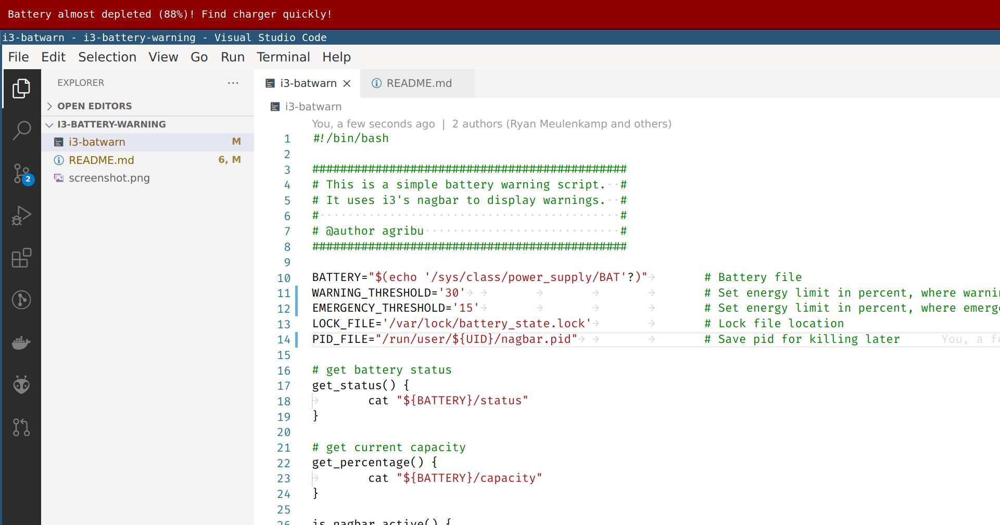

i3-battery-warning
==================

This is a simple battery warning script. It uses i3's nagbar to display warnings.

Let this script run as a cronjob.

Open your crontab.

’’’Shell
crontab -e
’’’

Add the following line to check battery status every minute

’’’
*/1 * * * * /PATH/TO/YOUR/SCRIPT/i3-batwarn
’’’

If the need to trouble shoot arises one could pipe the cron job output to a file like

’’’
*/1 * * * * /PATH/TO/YOUR/SCRIPT/i3-batwarn > /tmp/batterywarn.log
’’’

If the script only works when invoked from terminal and not as a crobjob:

’’’
*/1 * * * * DISPLAY=:0 /PATH/TO/YOUR/SCRIPT/i3-batwarn
’’’

screenshot
==========

fork changes
============

- Added a warning level in addition to existing threshold
- Check more often for the charger when de nagbar is active
- Major refactoring 
